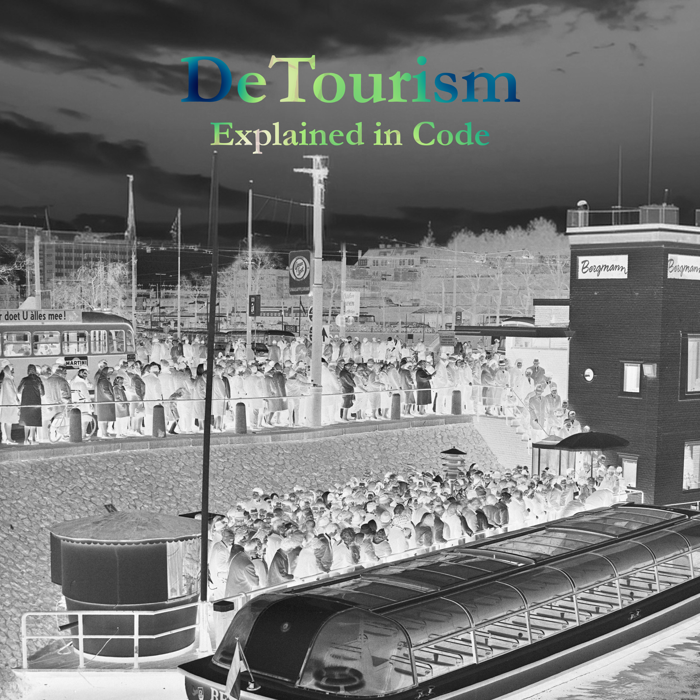

DeTourism is a data-driven urban analysis project that explores how tourism impacts public space usage in Amsterdam. By combining spatial data, reviews, and network analysis, the project visualizes patterns of tourist pressure across the city and proposes strategies to better distribute visitors. This repository contains the full codebase used for processing data, generating maps, and building the interactive dashboard that supports the project’s findings.

Work in progress
